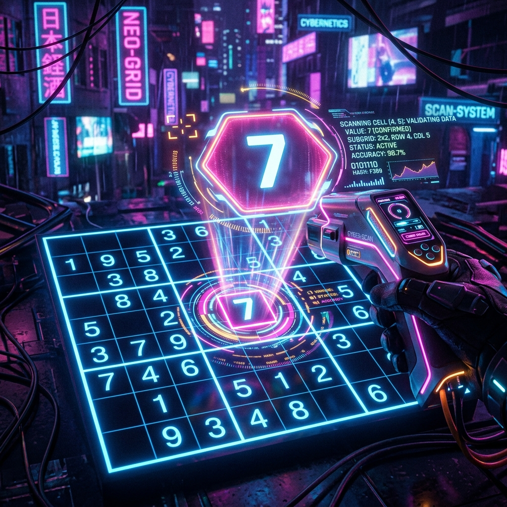
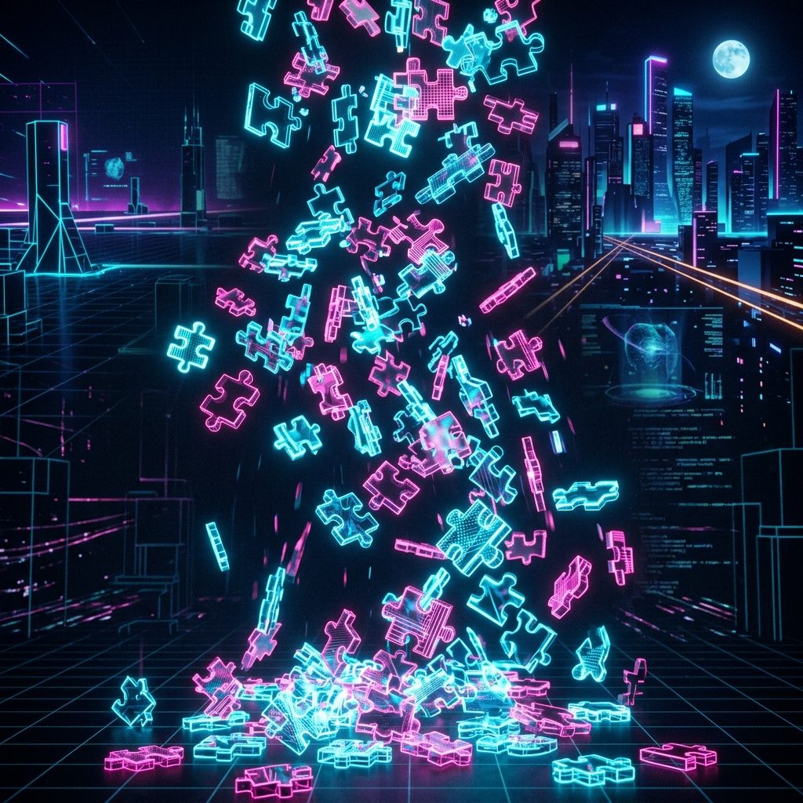

# 🧩 Ultimate Sudoku Solver & DSA Playground

A high-performance, interactive Sudoku Solver and educational dashboard supporting grid sizes from **4×4 up to 25×25**. Features a responsive HTML5 Canvas "force field" starfield background and a detailed visual playground for **7 core Data Structures and Algorithms (DSA)** concepts.

---

## 🚀 Key Features

* **Multi-Size Grid Support**: Generates and solves grids of sizes **4×4, 6×6, 8×8, 9×9 (classic), 12×12, 16×16, and 25×25** with dynamic typography scaling.
* **Interactive Force-Field Starfield**: A high-performance, custom HTML5 Canvas particle physics engine. Stars float freely behind panels, react dynamically to cursor movement with magnetic repulsion, and are masked out strictly behind the Sudoku board to keep the game workspace clean.
* **Dual Theme Engine**: Transition instantly between a glowing **Cyberpunk Synthwave** dark mode and a soft **Rose-Teal** pastel light mode.
* **Backtracking Engine with MRV**: Solves complex boards in milliseconds using recursive backtracking optimized with the Minimum Remaining Values (MRV) heuristic.
* **Undo & Move History**: Fully functional state rollback system backed by a LIFO stack.

---

## 📊 DSA Educational Dashboard

This project is built from the ground up to showcase how academic computer science foundations power real-world applications. The bottom of the page features an interactive dashboard demonstrating **7 core DSA concepts** using custom illustrations, bulleted explanations, and code snippets from the actual engine:

| Concept | Description | Visual Representation |
|---|---|---|
| **1. 2D Array Matrix** | Represents the Sudoku board as an $N \times N$ matrix. Traversal checks constraints across intersecting coordinates in $O(N)$ linear time. |  |
| **2. Recursion & Stack** | Solves grid subproblems recursively. Guesses are saved in the browser call stack, unwinding on solution success. |  |
| **3. Backtracking Search** | A Depth-First Search (DFS) that explores decision trees. Invalid paths are pruned early, triggering variable rollback. |  |
| **4. MRV Heuristic** | Selects the most constrained cell (fewest candidates) to solve next, accelerating performance by over $1000\times$. |  |
| **5. LIFO Undo Stack** | Implements the Undo history. Board states are pushed onto a LIFO stack, and popped off to restore previous cells. |  |
| **6. Fisher-Yates Shuffle** | Shuffles cell indexes and symbols in $O(N)$ linear time to guarantee unbiased, randomized board generations. |  |
| **7. Graph Coloring** | Models cells as vertices and constraint rows/cols/boxes as edges, linking Sudoku to NP-complete CSP logic. |  |

---

## 🛠️ Built With

* **Markup**: HTML5 (Semantic Structure)
* **Styling**: Vanilla CSS3 (Custom properties, grid layouts, glassmorphism, 3D card transforms)
* **Logic**: Vanilla JavaScript (ES6+ Object Oriented Architecture)
* **Background Canvas**: Native HTML5 Canvas 2D API (Vector math, physics simulations)

---

## 💻 Running Locally

No compilation or external dependencies are required. To run:
1. Clone this repository:
   ```bash
   git clone https://github.com/suryaprakash0629/Ultimate-Sudoku-Solver.git
   ```
2. Double-click [index.html](index.html) to run it directly in your web browser.

---

## 📂 File Structure

```
├── assets/                  # Generated 3D DSA illustrations
│   ├── dsa_matrix.png
│   ├── dsa_recursion.png
│   ├── dsa_backtrack.png
│   ├── dsa_mrv.png
│   ├── dsa_stack.png
│   ├── dsa_shuffle.png
│   └── dsa_graph.png
├── index.html               # Main page layout & structural skeletons
├── style.css                # Cyberpunk styling, responsive cards, 3D tilts
├── app.js                   # Sudoku game state, validation, backtrack solver
├── background.js            # Custom vector force-field starfield canvas engine
├── push_to_github.ps1       # Automated GitHub push helper script
└── README.md                # This project overview
```
